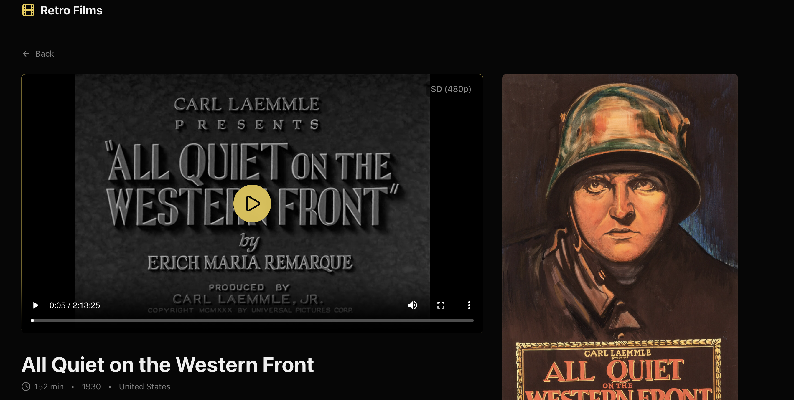

# Vaiki Retro Films Streamer — Frontend


A demo adaptive bitrate streaming platform showcasing a React frontend for a retro/classic film library. Built as a portfolio project to demonstrate full-stack streaming architecture with AWS media delivery.

> 🎬 **[Live Demo](https://retro-films-c5171.web.app)** · 📦 **[Backend Repository](https://github.com/hallapmark/vaiki-backend)**



<!-- TODO: Replace with actual screenshot or GIF of the player in action -->

---

## Project Overview

Vaiki is a retro films streaming platform that demonstrates production-grade video delivery patterns. The platform streams classic public domain films using adaptive bitrate technology (HLS) which allows smooth playback across changing network conditions.

### System Architecture

```
┌─────────────────┐                 ┌──────────────────┐
│                 │                 │                  │
│  React Frontend │◀────────────────│  Backend API     │
│                 │  Signed URLs    │  (Render)        │
│                 │                 │                  │
└────────┬────────┘                 └──────────────────┘
         │
         │ HLS video streams
         │ (using signed URLs)
         │
         ▼
┌─────────────────────────────┐
│          AWS                │
│  S3 + CloudFront CDN        │
│  (Media Storage + CDN)      │
└─────────────────────────────┘
```

- **AWS S3 + CloudFront**: Chosen for S3's durability with large media files and CloudFront's global CDN for low-latency streaming in varying locations.
- **Render (Backend)**: Containerized deployment, rapid iteration on business logic.
- **React + Vite (Frontend)**: Modern frontend framework, fast hot module replacement for convenient development.

---

## Features

- **Adaptive Bitrate Streaming** — HLS player with automatic quality switching (480p SD → 720p HD → 1080p HD) and quality badge display
- **Responsive Movie Browser** — Grid-based movie catalog with category sections and featured hero banner
- **Secure Playback** — Time-limited signed URLs for video streams (generated by backend)
- **Modern UX** — Lazy-loaded images, parallel data fetching, hover effects, and smooth transitions
- **Mobile-First Design** — Responsive layouts from 2 to 5 columns based on viewport

---

## Getting Started

### Prerequisites

- Node.js 18+
- npm or yarn

### Environment Setup for Local Dev

Create a `.env.development.local` file in the project root:

```env
VITE_BACKEND_URL=http://localhost:8080
```

Point this to your running instance of [vaiki-backend](https://github.com/hallapmark/vaiki-backend).

### Installation

```bash
# Install dependencies
npm install

# Start development server
npm run dev

# Build for production
npm run build

# Preview production build
npm run preview
```

---

## Project Structure

```
src/
├── api/          # Backend API integration with typed fetch functions
├── components/   # Reusable UI components (HlsPlayer, MovieCard, etc.)
├── pages/        # Route-level page components
└── data/         # Type definitions and mock data
```

---

## Related

- **Backend API**: [vaiki-backend](https://github.com/hallapmark/vaiki-backend) — Go service handling movie metadata and signed URL generation
- **Live Demo**: [retro-films-c5171.web.app](https://retro-films-c5171.web.app)

---

## Content Note

All films featured in this demo are in the public domain, including classics such as _All Quiet on the Western Front_ (1930), _His Girl Friday_ (1940), and _Charade_ (1963).
